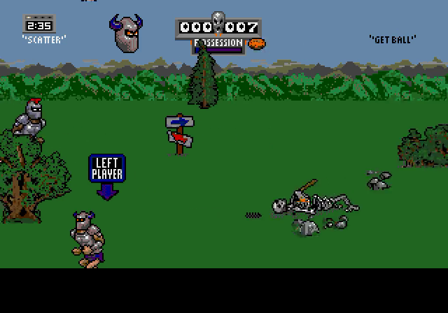

# genrecomp

A toolkit for statically recompiling Sega Genesis / Mega Drive games to native
code. A title's generator turns the game's 68000 machine code into C, and
genrecomp supplies what that code talks to: the video and sound chips, the Z80,
controllers, and a window or a headless recorder. The chips come from
[Genesis Plus GX](https://github.com/ekeeke/Genesis-Plus-GX). The 68000 is never
emulated; the game logic runs as compiled C.

Part of the sp00nznet recomp family (xboxrecomp, ps3recomp, snesrecomp,
lynxrecomp, ...) and follows its shared house style: the same CLI flags, a
headless mode, and no game data or generated code in any repo.

## Status

**Alpha, unversioned.** One title plays: Pigskin Footbrawl reaches a full
one-player game. Audio is generated but not yet verified by ear, and there
is no conformance harness yet (see [ROADMAP.md](ROADMAP.md)).

| Title | Repo | State |
|---|---|---|
| Jerry Glanville's Pigskin Footbrawl | [sp00nznet/pigskin](https://github.com/sp00nznet/pigskin) (private) | In game: menus and full matches play |
| General Chaos | [sp00nznet/genchaos](https://github.com/sp00nznet/genchaos) | Boots to its main loop; not yet on this runtime's fixes |

## Screenshots

Pigskin Footbrawl, recompiled, recorded headless with `--record`:



## Getting Started

genrecomp is a library, so the first successful run is: it builds, the
self-check passes, and the reference runner plays your ROM. You need your own
Genesis ROM; none is provided or downloaded.

### Quick start (Windows)

1. Download this repo (Code → Download ZIP) and unzip it, or clone it.
2. Double-click **`Setup.cmd`**. It checks for Git, CMake, Visual Studio 2022
   (C++ workload) and SDL2 via vcpkg, and **asks before installing** anything
   missing, saying what and how big. It then fetches Genesis Plus GX, builds,
   and runs the self-check. If a step fails, it stops with one sentence on what
   to do and keeps the details in `setup.log`. Rerunning skips finished steps.
3. When it asks, drag your ROM into the window for a 600-frame smoke test, or
   press Enter to skip.
4. It leaves **`Reference Runner.cmd`** in the folder: drag a ROM onto it to
   play it.

On Linux: `./setup.sh` (uses apt; `./setup.sh --yes path/to/rom.gen` runs
unattended).

### Step by step

Prerequisites: Git, CMake 3.16+, Visual Studio 2022 with "Desktop development
with C++" (or GCC/Clang on Linux), and SDL2 2.x (Windows: vcpkg; Linux:
`libsdl2-dev`). `ffmpeg` on PATH is only needed for `--record`.

1. Get the source with its submodule:
   ```
   git clone --recursive https://github.com/sp00nznet/genrecomp.git
   cd genrecomp
   ```
   Already cloned without `--recursive`? `git submodule update --init`.
2. SDL2 (Windows):
   ```
   C:\vcpkg\vcpkg.exe install sdl2:x64-windows
   ```
3. Configure and build:
   ```
   cmake -S . -B build -G "Visual Studio 17 2022" -A x64 -DCMAKE_TOOLCHAIN_FILE=C:/vcpkg/scripts/buildsystems/vcpkg.cmake
   cmake --build build --config Release
   ```
   Expected: the last lines name `genrecomp.lib`, `genrecomp_test_runtime.exe`,
   `genrecomp_minimal.exe` and `genrecomp_ref.exe` under `build\...\Release\`.
4. Self-check:
   ```
   ctest --test-dir build -C Release
   ```
   Expected: `100% tests passed, 0 tests failed out of 1`.
5. Play your ROM on the reference runner, headless, for 10 seconds:
   ```
   build\Release\genrecomp_ref.exe --headless --frames 600 --record smoke.mp4 path\to\your.gen
   ```
   Expected last line: `platform: reached --frames 600, exiting`.

Usual trip-ups:
- `python` or `cmake` "not found" right after installing: open a new terminal
  so the new PATH applies.
- `Could not find a package configuration file provided by "SDL2"`: the
  vcpkg toolchain file wasn't passed, or SDL2 was installed for another
  triplet. Delete `build\` and redo step 3.
- `ext/Genesis-Plus-GX` is empty: step 1's submodule command. A GitHub ZIP
  never includes submodules; `Setup.cmd` fetches it for you.

## Usage

A title links `genrecomp`, registers its generated functions, and hands
control to them through `func_table_call`. Pigskin's
[`src/main.c`](https://github.com/sp00nznet/pigskin) is the working example;
[`examples/minimal`](examples/minimal/main.c) is the smallest skeleton.

Every title and the reference runner take the same flags:

```
--headless              no window, no audio device, no frame pacing (works over RDP)
--record out.mp4        pipe every frame to ffmpeg
--frames N              exit after N frames
--press F:BTN[:LEN]     hold BTN (START, A+RIGHT, ...) from frame F for LEN frames
--ram-dump DIR[:N]      RAM + VDP state to DIR/ram_<frame>.bin every N frames
```

Finding a recompilation bug is usually: record the title and `genrecomp_ref`
with the same `--press` script, see where the pictures diverge, then diff
`--ram-dump` output around that frame. Worked through in
[docs/recomp-runtime.md](docs/recomp-runtime.md).

## Documentation

- [docs/architecture.md](docs/architecture.md): the parts and the frame's data flow
- [docs/recomp-runtime.md](docs/recomp-runtime.md): how recompiled code drives
  GPGX, and every timing trap found so far
- [docs/memory_map.md](docs/memory_map.md): the Genesis 68K address space

## Building from source

Step by step above is the build. CMake options: `GENRECOMP_BUILD_EXAMPLES`
(default ON). CI builds and runs `ctest` on Windows (MSVC) and Linux (GCC)
for every push and PR.

## License

genrecomp's code is [MIT](LICENSE). It links Genesis Plus GX, whose licence
forbids selling or commercial use, so **any binary built with genrecomp is
non-commercial**. Details and the full text: [NOTICE](NOTICE).

Generated source and game data never go in this repo or any title's repo: you
supply your own ROM and run the generator locally.

## Credits

- Genesis Plus GX: Charles MacDonald, Eke-Eke, and contributors. Every chip
  genrecomp exposes is their work.
- Nuked OPN2 (YM2612, inside Genesis Plus GX): Alexey Khokholov.

## Contributors

See [CONTRIBUTING.md](CONTRIBUTING.md). No outside contributions yet; when there
are, they are credited in `CONTRIBUTORS.md`.
